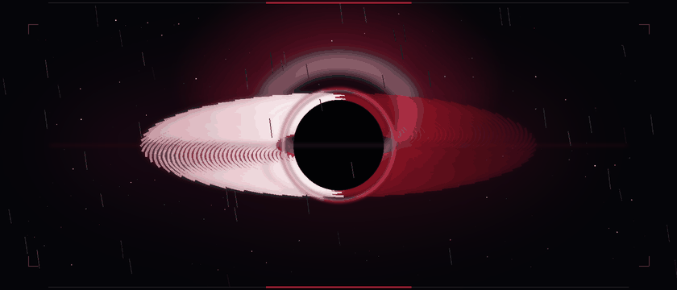
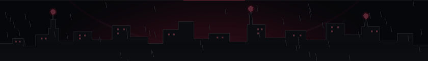

<div align="center">

  

  <br/><br/>

  <a href="https://github.com/mayankyenugwar1">
    
  </a>
  &nbsp;
  <a href="mailto:mayankyenugwar1@gmail.com">
    
  </a>
  &nbsp;
  

  <br/><br/>

  

  <br/>

  <sub><i>Gravitational lensing simulation: Relativistic Doppler accretion disk and photon sphere distortion.</i></sub>

</div>

<br/>

<p align="center">
  
</p>

## ◈ 01 // ABOUT THE OPERATOR

```text
IDENTITY   : Mayank Yenu Gwar
STATUS     : Engineering Student & Developer
FOCUS      : Artificial Intelligence • High-Performance Web Applications • Interactive Systems
PHILOSOPHY : "Minimalist surfaces concealing high-density computing engines."
```

I am an engineering student and software developer focused on the intersection of **artificial intelligence**, **reactive digital architecture**, and **tactile user experiences**. 

My work draws inspiration from deep-space physics, neo-noir atmospheres, and high-performance operating interfaces. I build systems that prioritize computational clarity, disciplined typography, and resilient codebases. Whether designing unified productivity operating environments or meditative cosmic tools, I strive to turn abstract mathematical and algorithmic principles into purposeful software.

<br/>

<p align="center">
  
</p>

## ◈ 02 // CURRENT ORBITS & TECHNICAL FOCUS

* **TITAN Core Architecture** — Architecting a unified productivity OS with strict TypeScript, React 19, and Supabase to consolidate tactical directives, OKR roadmaps, and node-based automation.
* **Generative & Cosmic Interfaces** — Exploring perspective-shifting web applications (such as [EXHALE](https://github.com/mayankyenugwar1/EXHALE)) that merge audio-visual atmospheres with mental decompression.
* **Agentic Workflows & Autonomous Tools** — Investigating low-latency local model orchestration, agent tooling, and contextual knowledge graphs.
* **System Performance & Precision UI** — Honing high-density interfaces with Tailwind CSS v4, Radix UI primitives, and hardware-accelerated Framer Motion interactions.

<br/>

<p align="center">
  
</p>

## ◈ 03 // TECHNICAL ARSENAL

### Core Languages
<p align="left">
  
  
  
  
  
  
</p>

### Frameworks & Libraries
<p align="left">
  
  
  
  
  
  
  
</p>

### Infrastructure, Tooling & Runtime
<p align="left">
  
  
  
  
  
  
  
</p>

<br/>

<p align="center">
  
</p>

## ◈ 04 // FEATURED ARCHITECTURES

<table>
  <thead>
    <tr>
      <th width="35%">Project</th>
      <th width="45%">Description</th>
      <th width="20%">Stack</th>
    </tr>
  </thead>
  <tbody>
    <tr>
      <td>
        <a href="https://github.com/mayankyenugwar1/TITAN">
          <b>TITAN V1.0</b>
        </a>
        <br/>
        <sub>Autonomous Productivity OS</sub>
      </td>
      <td>
        A unified command center connecting Mission Control, Chrono Matrix, Knowledge OS (Second Brain), Projects &amp; OKRs, and an AI Commander Agent into one seamless workspace.
      </td>
      <td>
        <code>React 19</code><br/>
        <code>TypeScript</code><br/>
        <code>Tailwind v4</code><br/>
        <code>Supabase</code>
      </td>
    </tr>
    <tr>
      <td>
        <a href="https://github.com/mayankyenugwar1/EXHALE">
          <b>EXHALE</b>
        </a>
        <br/>
        <sub>Cosmic Decompression Space</sub>
        <br/>
        <a href="https://exhale-cosmic.netlify.app">
          <sub>🔗 Live Demo</sub>
        </a>
      </td>
      <td>
        A minimalist cosmic experience creating psychological distance from overwhelming thoughts through reflective writing, guided breathing, and deep-space perspective shift.
      </td>
      <td>
        <code>React</code><br/>
        <code>TypeScript</code><br/>
        <code>Framer Motion</code><br/>
        <code>Netlify</code>
      </td>
    </tr>
    <tr>
      <td>
        <a href="https://github.com/mayankyenugwar1/Paranoia">
          <b>Paranoia</b>
        </a>
        <br/>
        <sub>Gaming Platform</sub>
      </td>
      <td>
        Interactive entertainment and digital gaming exploration environment.
      </td>
      <td>
        <code>JavaScript</code><br/>
        <code>Game Dev</code>
      </td>
    </tr>
  </tbody>
</table>

<br/>

<p align="center">
  
</p>

## ◈ 05 // TELEMETRY & ACTIVITY METRICS

<div align="center">

  
  &nbsp;
  

  <br/><br/>
  <sub><i>Telemetry streams depend on GitHub's public API and third-party caching relays.</i></sub>

</div>

<br/>

<p align="center">
  
</p>

## ◈ 06 // HORIZON

<div align="center">

  

  <br/><br/>

  <p>
    <i>"In the quiet depths of the void, every line of code bends the horizon."</i>
  </p>

  <sub>© 2026 Mayank Yenu Gwar • All telemetry nominal</sub>

</div>
