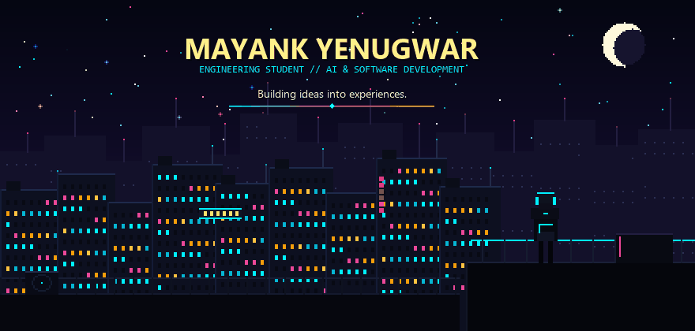
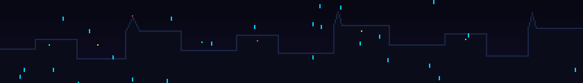

<div align="center">

  

  <br/>

  <p align="center">
    <a href="https://github.com/mayankyenugwar1">
      
    </a>
    &nbsp;
    <a href="mailto:mayankyenugwar1@gmail.com">
      
    </a>
    &nbsp;
    
  </p>

</div>

<br/>

<p align="center">
  
</p>

## ⚡ 01 // ABOUT THE OPERATOR

```yaml
Operator : MAYANK YENUGWAR
Status   : Engineering Student & Developer
Focus    : Artificial Intelligence • High-Performance Web Architecture • Interactive Systems
Mission  : Building ideas into experiences.
```

I am an engineering student and developer focused on **artificial intelligence**, **reactive software systems**, and **tactile digital experiences**. 

Drawing inspiration from retro-cyberpunk aesthetics, nocturnal cityscapes, and high-performance system design, I create software that combines computational discipline with clean, immersive interfaces. From full-scale productivity operating systems to meditative atmospheric web applications, I enjoy architecting resilient tools that solve real-world problems.

<br/>

<p align="center">
  
</p>

## 🚀 02 // FEATURED PROJECTS

<table>
  <tr>
    <td width="50%" valign="top">
      <h3 style="margin-top:0;">
        <a href="https://github.com/mayankyenugwar1/TITAN">TITAN V1.0</a>
      </h3>
      <p><b>Autonomous Productivity Operating System</b></p>
      <p>A unified tactical workspace connecting Mission Control, Chrono Matrix, Knowledge OS (Second Brain), Projects &amp; OKRs, and an AI Commander Agent into one seamless environment.</p>
      <p>
        
        
        
        
        
      </p>
      <p>
        <a href="https://github.com/mayankyenugwar1/TITAN"><b>View Repository →</b></a>
      </p>
    </td>
    <td width="50%" valign="top">
      <h3 style="margin-top:0;">
        <a href="https://github.com/mayankyenugwar1/EXHALE">EXHALE</a>
      </h3>
      <p><b>Deep-Space Perspective &amp; Mindfulness Experience</b></p>
      <p>A minimalist cosmic experience that creates psychological distance from overwhelming thoughts through reflective writing, guided breathing, and deep-space perspective shift.</p>
      <p>
        
        
        
        
        
      </p>
      <p>
        <a href="https://github.com/mayankyenugwar1/EXHALE"><b>View Repository →</b></a> &nbsp;|&nbsp; 
        <a href="https://exhale-cosmic.netlify.app"><b>Live Demo ↗</b></a>
      </p>
    </td>
  </tr>
  <tr>
    <td colspan="2" valign="top">
      <h3 style="margin-top:0;">
        <a href="https://github.com/mayankyenugwar1/Paranoia">Paranoia</a>
      </h3>
      <p><b>Interactive Entertainment &amp; Gaming Platform</b></p>
      <p>Exploration environment for interactive gaming mechanics, responsive audio-visual feedback, and real-time state management.</p>
      <p>
        
        
      </p>
      <p>
        <a href="https://github.com/mayankyenugwar1/Paranoia"><b>View Repository →</b></a>
      </p>
    </td>
  </tr>
</table>

<br/>

<p align="center">
  
</p>

## 🛠 03 // TECHNICAL ARSENAL

### Core Languages
<p align="left">
  
  
  
  
  
  
</p>

### Frameworks & Libraries
<p align="left">
  
  
  
  
  
  
  
</p>

### Infrastructure & Tooling
<p align="left">
  
  
  
  
  
  
  
</p>

<br/>

<p align="center">
  
</p>

## 📊 04 // ACTIVITY TELEMETRY

<div align="center">

  
  &nbsp;
  

  <br/><br/>
  <sub><i>Telemetry streams reflect public repository metrics cached via GitHub API relays.</i></sub>

</div>

<br/>

<p align="center">
  
</p>

## 📡 05 // CONNECTIVITY

<p align="center">
  <a href="https://github.com/mayankyenugwar1">
    
  </a>
  &nbsp;
  <a href="mailto:mayankyenugwar1@gmail.com">
    
  </a>
</p>

<br/>

<div align="center">

  

  <br/><br/>

  <p>
    <i>"In the quiet glow of neon spires, ideas become reality."</i>
  </p>

  <sub>© 2026 Mayank Yenugwar • System operational.</sub>

</div>
