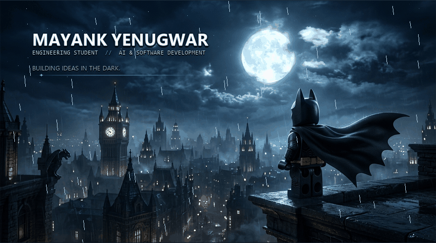

  

    

  

    
    &nbsp;&nbsp;
    
    &nbsp;&nbsp;
    
  

 

## 01 // ABOUT ME

Engineering student exploring **artificial intelligence**, **software development**, and **creative technology**.

Currently building AI systems, software products, and interactive experiences — from productivity tools to immersive digital environments.

 

## 02 // CURRENTLY BUILDING

* **[TITAN V1.0](https://github.com/mayankyenugwar1/TITAN)** — Architecting an autonomous productivity operating system connecting Mission Control, Chrono Matrix, Knowledge OS (Second Brain), Projects &amp; OKRs, and an AI Commander Agent into one command center.
* **[EXHALE](https://github.com/mayankyenugwar1/EXHALE)** — Refining a deep-space mindfulness experience combining generative cosmic aesthetics with psychological decompression.
* **[Paranoia](https://github.com/mayankyenugwar1/Paranoia)** — Developing an interactive entertainment platform exploring real-time game mechanics and state orchestration.

 

## 03 // FEATURED PROJECTS

### 01 // TITAN V1.0
**AUTONOMOUS PRODUCTIVITY OS**

A unified tactical workspace connecting Mission Control, Chrono Matrix, Knowledge OS (Second Brain), Projects &amp; OKRs, and an AI Commander Agent into one command center.

`React 19` &nbsp;•&nbsp; `TypeScript` &nbsp;•&nbsp; `Tailwind CSS v4` &nbsp;•&nbsp; `Supabase` &nbsp;•&nbsp; `Zustand`

[**View Repository →**](https://github.com/mayankyenugwar1/TITAN)

 

### 02 // EXHALE
**COSMIC MINDFULNESS EXPERIENCE**

A minimalist cosmic web experience creating psychological distance from overwhelming thoughts through reflective writing, guided breathing, and atmospheric pacing.

`React` &nbsp;•&nbsp; `TypeScript` &nbsp;•&nbsp; `Framer Motion` &nbsp;•&nbsp; `Tailwind CSS` &nbsp;•&nbsp; `Netlify`

[**View Repository →**](https://github.com/mayankyenugwar1/EXHALE) &nbsp;|&nbsp; [**Live Demo ↗**](https://exhale-cosmic.netlify.app)

 

### 03 // PARANOIA
**INTERACTIVE GAMING PLATFORM**

An interactive gaming environment exploring responsive audio-visual feedback and real-time state orchestration.

`JavaScript` &nbsp;•&nbsp; `HTML5 Canvas` &nbsp;•&nbsp; `Game Architecture`

[**View Repository →**](https://github.com/mayankyenugwar1/Paranoia)

 

## 04 // TECH STACK

**Languages**  
`TypeScript` &nbsp;•&nbsp; `JavaScript` &nbsp;•&nbsp; `Python` &nbsp;•&nbsp; `C++`

**Frontend**  
`React` &nbsp;•&nbsp; `Vite` &nbsp;•&nbsp; `Tailwind CSS` &nbsp;•&nbsp; `Framer Motion`

**Backend / Data**  
`Supabase` &nbsp;•&nbsp; `FastAPI`

**Tools**  
`Git` &nbsp;•&nbsp; `GitHub` &nbsp;•&nbsp; `Netlify` &nbsp;•&nbsp; `Capacitor`

 

## 05 // GITHUB ACTIVITY

Building in public.  
Learning by shipping.

 

  

 

## 06 // CONTACT

Feel free to connect, collaborate, or discuss projects:

* **GitHub**: [@mayankyenugwar1](https://github.com/mayankyenugwar1)
* **Email**: [mayankyenugwar1@gmail.com](mailto:mayankyenugwar1@gmail.com)

 

---

  

    <i>"Where ideas meet the night."</i>
  

  © 2026 Mayank Yenugwar • Built in the dark

