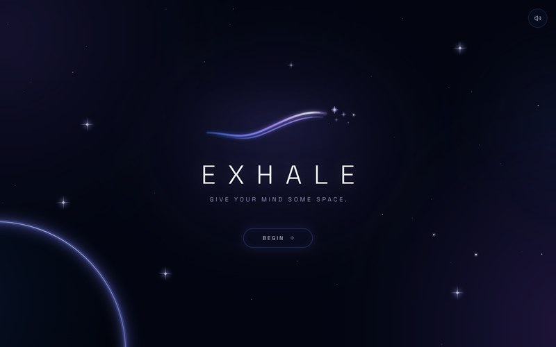

  

 

<table width="100%">
  <tr>
    <td width="33%" align="center" valign="middle">
      <b>GITHUB</b> 
      <a href="https://github.com/mayankyenugwar1"><code>mayankyenugwar1</code></a>
    </td>
    <td width="33%" align="center" valign="middle">
      <b>EMAIL</b> 
      <a href="mailto:mayankyenugwar1@gmail.com"><code>mayankyenugwar1@gmail.com</code></a>
    </td>
    <td width="34%" align="center" valign="middle">
      <b>FOCUS</b> 
      <code>AI • Software • Systems</code>
    </td>
  </tr>
</table>

 

## 01 // ABOUT ME

Engineering student exploring **artificial intelligence**, **software development**, and **creative technology**.

Currently building AI systems, software products, and interactive experiences — from productivity tools to immersive digital environments.

 

## 02 // CURRENTLY BUILDING

<table width="100%">
  <tr>
    <td width="33%" valign="top">
      <h4><a href="https://github.com/mayankyenugwar1/TITAN">TITAN V1.0</a></h4>
      
<b>Productivity Operating System</b>

      
Autonomous productivity platform integrating task planning, knowledge management, and AI assistance.

      
<a href="https://github.com/mayankyenugwar1/TITAN"><b>Repository →</b></a>

    </td>
    <td width="33%" valign="top">
      <h4><a href="https://github.com/mayankyenugwar1/EXHALE">EXHALE</a></h4>
      
<b>Mindfulness Web Application</b>

      
Minimalist mindfulness application featuring guided breathing rhythms and reflective writing.

      
<a href="https://github.com/mayankyenugwar1/EXHALE"><b>Repository →</b></a>

    </td>
    <td width="34%" valign="top">
      <h4><a href="https://github.com/mayankyenugwar1/Paranoia">PARANOIA</a></h4>
      
<b>Interactive Game</b>

      
Browser-based interactive game exploring real-time state orchestration and responsive audio-visual mechanics.

      
<a href="https://github.com/mayankyenugwar1/Paranoia"><b>Repository →</b></a>

    </td>
  </tr>
</table>

 

## 03 // FEATURED PROJECTS

<table width="100%">
  <tr>
    <td valign="top">
      <h3>TITAN V1.0</h3>
      
<code>AUTONOMOUS PRODUCTIVITY OS</code>

      

        A unified productivity operating system connecting project tracking, knowledge management (Second Brain), and an autonomous AI agent into a single workspace.
      

      

        <b>Tech Stack:</b> <code>React 19</code> • <code>TypeScript</code> • <code>Tailwind CSS v4</code> • <code>Supabase</code> • <code>Zustand</code> • <code>Vite</code>
      

      

        <a href="https://github.com/mayankyenugwar1/TITAN"><b>Repository →</b></a> &nbsp;|&nbsp; 
        <a href="https://titan-productivity-os.vercel.app"><b>Live Demo ↗</b></a>
      

    </td>
  </tr>
</table>

 

<table width="100%">
  <tr>
    <td width="58%" valign="top">
      <h3>EXHALE</h3>
      
<code>COSMIC MINDFULNESS EXPERIENCE</code>

      

        A minimalist cosmic web application designed to reduce stress through reflective writing, guided breathing rhythms, and deep-space visual design.
      

      

        <b>Tech Stack:</b> <code>React</code> • <code>TypeScript</code> • <code>Framer Motion</code> • <code>Tailwind CSS</code> • <code>Netlify</code>
      

      

        <a href="https://github.com/mayankyenugwar1/EXHALE"><b>Repository →</b></a> &nbsp;|&nbsp; 
        <a href="https://exhale-cosmic.netlify.app"><b>Live Demo ↗</b></a>
      

    </td>
    <td width="42%" align="center" valign="middle">
      
    </td>
  </tr>
</table>

 

## 04 // TECH STACK

<table width="100%">
  <tr>
    <td width="25%" valign="top">
      <b>LANGUAGES</b>  
      <code>TypeScript</code> 
      <code>JavaScript</code> 
      <code>Python</code> 
      <code>C++</code>
    </td>
    <td width="25%" valign="top">
      <b>FRONTEND</b>  
      <code>React</code> 
      <code>Vite</code> 
      <code>Tailwind CSS</code> 
      <code>Framer Motion</code>
    </td>
    <td width="25%" valign="top">
      <b>BACKEND / DATA</b>  
      <code>Supabase</code> 
      <code>FastAPI</code>
    </td>
    <td width="25%" valign="top">
      <b>TOOLS</b>  
      <code>Git</code> 
      <code>GitHub</code> 
      <code>Netlify</code> 
      <code>Capacitor</code>
    </td>
  </tr>
</table>

 

## 05 // GITHUB ACTIVITY

  

 

## 06 // CONTACT

<table width="100%">
  <tr>
    <td width="50%" align="center" valign="middle">
      <b>GITHUB</b> 
      <a href="https://github.com/mayankyenugwar1"><code>github.com/mayankyenugwar1</code></a>
    </td>
    <td width="50%" align="center" valign="middle">
      <b>EMAIL</b> 
      <a href="mailto:mayankyenugwar1@gmail.com"><code>mayankyenugwar1@gmail.com</code></a>
    </td>
  </tr>
</table>

 

  

    

  © 2026 Mayank Yenugwar

