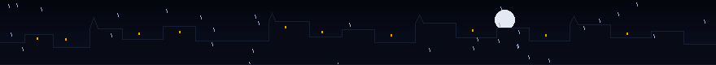

  

    

  

    
    &nbsp;&nbsp;
    
    &nbsp;&nbsp;
    
  

 

  

## 01 // ABOUT ME

Engineering student exploring **artificial intelligence**, **software development**, and **creative technology**.

Currently building projects that turn ideas into experiences — balancing disciplined systems architecture with atmospheric, tactile digital design.

 

  

## 02 // CURRENTLY BUILDING

* **[TITAN V1.0](https://github.com/mayankyenugwar1/TITAN)** — Architecting an autonomous productivity operating system connecting Mission Control, Chrono Matrix, Knowledge OS (Second Brain), Projects &amp; OKRs, and an AI Commander Agent into one command center.
* **[EXHALE](https://github.com/mayankyenugwar1/EXHALE)** — Refining a deep-space mindfulness experience combining generative cosmic aesthetics with psychological decompression.
* **Intelligent Tooling** — Exploring low-latency local model orchestration, agentic workflows, and contextual state systems.

 

  

## 03 // FEATURED PROJECTS

### ⚔️ [TITAN V1.0](https://github.com/mayankyenugwar1/TITAN) — Autonomous Productivity OS
> A unified tactical workspace connecting Mission Control, Chrono Matrix, Knowledge OS, Projects &amp; OKRs, and an AI Commander Agent into one command center.

`React 19` &nbsp;•&nbsp; `TypeScript` &nbsp;•&nbsp; `Tailwind CSS v4` &nbsp;•&nbsp; `Supabase` &nbsp;•&nbsp; `Zustand`

[**Explore Repository →**](https://github.com/mayankyenugwar1/TITAN)

 

### 🌌 [EXHALE](https://github.com/mayankyenugwar1/EXHALE) — Deep-Space Perspective & Mindfulness
> A minimalist cosmic experience creating psychological distance from overwhelming thoughts through reflective writing, guided breathing, and atmospheric pacing.

`React` &nbsp;•&nbsp; `TypeScript` &nbsp;•&nbsp; `Framer Motion` &nbsp;•&nbsp; `Tailwind CSS` &nbsp;•&nbsp; `Netlify`

[**Explore Repository →**](https://github.com/mayankyenugwar1/EXHALE) &nbsp;|&nbsp; [**Live Demo ↗**](https://exhale-cosmic.netlify.app)

 

### 🕹️ [Paranoia](https://github.com/mayankyenugwar1/Paranoia) — Interactive Entertainment Platform
> An interactive gaming environment exploring responsive audio-visual feedback and real-time state orchestration.

`JavaScript` &nbsp;•&nbsp; `Canvas` &nbsp;•&nbsp; `Interactive Systems`

[**Explore Repository →**](https://github.com/mayankyenugwar1/Paranoia)

 

  

## 04 // TECH STACK

**Languages**  
`TypeScript` &nbsp; `JavaScript` &nbsp; `Python` &nbsp; `SQL` &nbsp; `HTML5` &nbsp; `CSS3`

**Frameworks &amp; Libraries**  
`React 19` &nbsp; `Tailwind CSS v4` &nbsp; `Framer Motion` &nbsp; `TanStack Query` &nbsp; `Radix UI` &nbsp; `Zustand` &nbsp; `Recharts`

**Infrastructure &amp; Tooling**  
`Supabase` &nbsp; `Docker` &nbsp; `Vite` &nbsp; `Capacitor` &nbsp; `Vercel` &nbsp; `Netlify` &nbsp; `Git`

 

  

## 05 // GITHUB ACTIVITY

  
  &nbsp;
  

 

  

## 06 // CONTACT

Feel free to connect, collaborate, or discuss projects:

* **GitHub**: [@mayankyenugwar1](https://github.com/mayankyenugwar1)
* **Email**: [mayankyenugwar1@gmail.com](mailto:mayankyenugwar1@gmail.com)

 

  

    

  

    <i>"Where ideas meet the night."</i>
  

  © 2026 Mayank Yenugwar • Built in the dark

